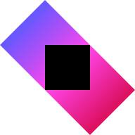

### OS & Apps
<code></code>
<code></code>
<code></code>

### Languages & Frameworks
<code></code>
<code></code>
<code></code>

### I Keep Eyes On
<code></code>
<code></code>
<code></code>
<code></code>
